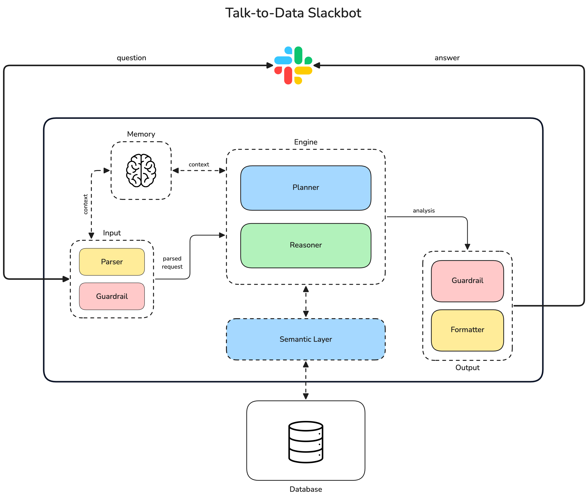

# Talk-to-Data Slackbot

A Slack bot that lets you ask natural-language questions about internal data (Postgres) and get answers directly in Slack. Powered by [PandasAI](https://docs.pandas-ai.com/) and OpenAI. No SQL or dashboards required.



## Features

- **Ask in Slack**: Mention the bot in a channel or send a DM; ask questions in plain language.
- **Queryable data**: Answers are based on tables exposed by the semantic layer (users, subscriptions, payments, sessions).
- **Follow-up context**: Questions in the same thread keep conversation context for multi-turn queries.
- **Input guardrails**:
  - Blocks questions containing PII (e.g. email, phone); asks the user to rephrase.
  - Answers “what data is available?” (and similar) with a static list of tables and short descriptions—no LLM call.
  - Asks for clarification when the question is too vague or out of scope.
- **Output**: Slack-friendly formatting, optional file upload (e.g. charts); output guardrails redact PII from responses before posting.

## Requirements

- **Python 3.11**
- **Poetry** for dependency management
- **Postgres** database with the expected schema (or compatible tables)
- **OpenAI** API key
- **Slack app** with Bot Token and App Token (Socket Mode), and the right OAuth scopes and event subscriptions (`app_mention`, `message` in DMs). See [Slack API](https://api.slack.com/) for creating an app.

## Installation

1. Clone the repository.
2. From the project root, run:
  ```bash
   poetry install
  ```
   For development and tests:
   Poetry creates and uses a virtual environment automatically.

## Configuration

1. Copy `.env.example` to `.env` and fill in the values.
2. **Required variables**
  - **Postgres**: `DB_HOST`, `DB_PORT`, `DB_NAME`, `DB_USER`, `DB_PASS`
  - **OpenAI**: `OPENAI_API_KEY`
  - **Slack**: `SLACK_BOT_TOKEN`, `SLACK_APP_TOKEN`
3. **Optional**
  - `OPENAI_MODEL` — default `gpt-4o-mini`
  - `SEMANTIC_LAYER_ORGANIZATION` — PandasAI dataset path prefix; default `organization`
  - `SLACK_SIGNING_SECRET` — if needed for your setup

Do not commit `.env` or real secrets; use environment variables only.

## Running the bot

From the project root:

```bash
poetry run python -m talk_to_data_slackbot.main
```

The app uses **Slack Socket Mode**, so no public URL is required for receiving events.

## Usage in Slack

- **Channels**: Mention the bot and ask a data question in the same message. You can send follow-up questions in the thread.
- **DMs**: Send a message; the bot replies in the thread. Follow-up messages in the thread use conversation memory.

**Example questions**

- “How many users do we have?”
- “What’s the total revenue by plan?”
- “What data can I query?” — returns a list of available tables and descriptions.

If your question is vague or off-topic, the bot asks for clarification. If it contains personal or sensitive information (e.g. email, phone), the bot asks you to rephrase without PII.

## Project structure

- **Input** (`talk_to_data_slackbot/input/`) — Parse Slack events (question, conversation key); input guardrails (PII block, “what data available”, vague/out-of-scope).
- **Engine** (`talk_to_data_slackbot/engine/`) — PandasAI Agent; `chat` and `follow_up` for answering questions.
- **Semantic Layer** (`talk_to_data_slackbot/semantic_layer/`) — Postgres connection, table metadata (`TABLE_SOURCES`), `get_data_sources()` for the Agent.
- **Output** (`talk_to_data_slackbot/output/`) — Output guardrails (PII redaction), formatter, Slack posting (text and optional file).
- **Memory** — Conversation context per thread (in-memory agent cache via PandasAI Agent).
- **Main** (`talk_to_data_slackbot/main.py`) — Bolt app, Socket Mode, message handler: Input → guardrails → pipeline or guardrail response → Output.

## Testing

Run tests:

```bash
poetry run pytest -q
```

Verbose:

```bash
poetry run pytest -v
```

## Author

Guilherme Bracco